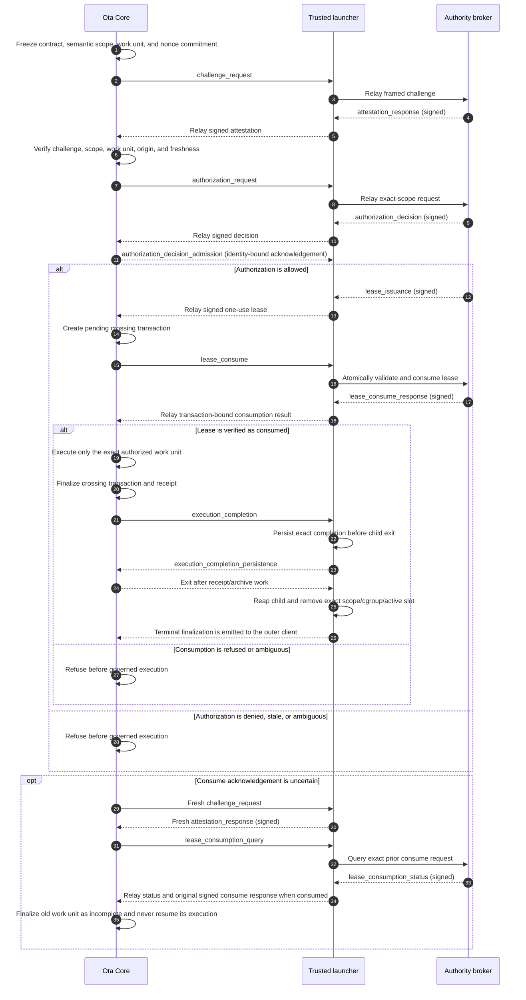
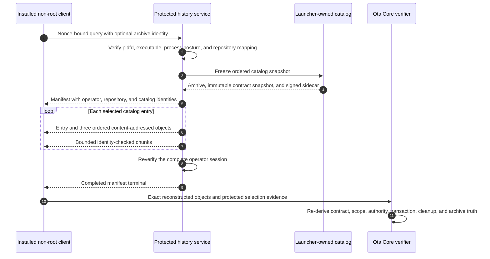

<!--
                █████
               ░░███
       ██████  ███████    ██████
      ███░░███░░░███░    ░░░░░███
     ░███ ░███  ░███      ███████
     ░███ ░███  ░███ ███ ███░░███
     ░░██████   ░░█████ ░░████████
      ░░░░░░     ░░░░░   ░░░░░░░░

   Copyright (C) 2026 — 2026, Ota. All Rights Reserved.

   DO NOT ALTER OR REMOVE COPYRIGHT NOTICES OR THIS FILE HEADER.

   Licensed under the Apache License, Version 2.0. See LICENSE for the full license text.
   You may not use this file except in compliance with the License.
   Unless required by applicable law or agreed to in writing, software distributed under the
   License is distributed on an "AS IS" BASIS, WITHOUT WARRANTIES OR CONDITIONS OF ANY KIND,
   either express or implied. See the License for the specific language governing permissions
   and limitations under the License.

   If you need additional information or have any questions, please email: os@ota.run
-->

# Ota Authority Protocol

Canonical, provider-neutral wire protocol for Ota crossing authority.

This crate publishes the stable message model, framing rules, semantic identity helpers, and
foundation vectors intended for Ota Core, trusted launchers, and independently operated authority
brokers. Cross-repository conformance becomes established only when those consumers pin and test
the same immutable crate revision.

## Boundary

This repository owns:

- protocol version and message-kind constants;
- exact serialized request, attestation, decision, lease, and consumption types;
- additive runtime-boundary attestation v2 types and canonical protected-launcher profiles;
- immutable principal-mapping, Ota process-posture, and systemd launcher-profile foundations for
  the planned production protected-launcher adapter;
- the bounded Linux systemd-launcher client/service request, output, and terminal frames;
- bounded four-byte big-endian framing;
- JCS plus SHA-256 message identities; and
- compatibility and adversarial conformance tests.

It does not own repository contracts, semantic-scope derivation, admission policy, signing keys,
approval workflows, broker persistence, transport credentials, execution, receipts, or archives.
Those remain with Ota Core, the authority launcher, and the chosen broker implementation.

## Wire sequence

The seven broker wire messages, in order, are `challenge_request`, `attestation_response`,
`authorization_request`, `authorization_decision`, `lease_issuance`, `lease_consume`, and
`lease_consume_response`. The protected local launcher session additionally carries
`authorization_decision_admission`: a Core-authored acknowledgement that binds the exact verified
signed decision before the launcher journals relay evidence. It is integrity evidence, not a
second authority decision and not a lease. Recovery adds `lease_consumption_query` and
`lease_consumption_status`. Ota may execute the governed work unit only after it verifies a signed
`lease_consume_response` bound to the pending crossing transaction. Recovery never resumes that
old work unit: it reconciles the broker result, finalizes the abandoned local transaction as
incomplete, and requires a new authorization for any later execution.

### Protected history sequence

The first protected-history profile is one complete bounded snapshot with no pagination. A
pre-query refusal carries no invented query or manifest identity; a valid-query refusal carries no
manifest identity; a successful terminal requires the exact query and manifest identities. Object
identities derive from manifest, entry ordinal, catalog, kind, content identity, length, and chunk
count before the entry binds the three object identities, avoiding a circular hash dependency.
Repository and protected storage paths never cross this wire boundary.

For the protected systemd carrier, selected execution adds two private Core-to-launcher messages.
`launcher_execution_completion` binds the terminal crossing transaction, receipt posture, exact
work unit, and consumed-lease admission. The launcher durably journals that record before replying
with `launcher_execution_completion_persistence`. After Core exits, the launcher reaps the exact
child, removes the exact scope and cgroup, removes the active slot, and emits one
`LauncherExecutionFinalizationV1` inside the outer terminal frame. Completion is not cleanup
evidence. A live finalization is valid only when all four removal checks are true and the launcher-
observed child exit matches Core's completion. Schema v2 can instead record
`recovered_absent_completion_bound` after a launcher restart: it binds verified child absence to
Core's durable completion while explicitly carrying no observed exit code and no child-reaped
claim. Selected execution additionally uses an identity-bound terminal
persistence acknowledgement; the launcher must retain and replay the exact terminal until that
acknowledgement is received.

## Runtime-boundary attestation

The original `LauncherAttestationPayload` and v1 response domain remain immutable. They prove a
fresh launcher session bound to the challenge, work unit, and semantic scope, but they do not prove
strong runtime separation.

The additive `LauncherAttestationPayloadV2` uses the distinct
`ota-crossing-broker/attestation-response/v2` response domain and
`ota.crossing-broker.attestation.v2\0` identity domain. It carries one signed runtime-boundary
record with a stable profile ID, content-addressed profile identity, protected-launcher attestor
identity, launcher-session binding, and an ordered closed set of observations.

This crate publishes two canonical profile definitions:

- `ota.runtime-boundary.protected-launcher/v1` requires eleven launcher and runtime-separation
  observations.
- `ota.runtime-boundary.protected-launcher-image/v1` adds bound runner-image and hardening-profile
  identities.

Every required observation must be represented with its profile-defined evidence method. The
profile also requires bounded semantic identities for launcher binary/config measurements and,
for the image profile, image/hardening-profile measurements; it forbids arbitrary identities on
the remaining observations. Core, not this wire crate, owns trust-root selection, signature
verification, refusal semantics, and archive reconciliation. Provider attestation is not part of
these profiles.

The distinct `LauncherAttestationPayloadV3` uses
`ota-crossing-broker/attestation-response/v3` only for
`systemd_protected_launcher/v1`. It carries a complete, content-addressed
`SystemdProtectedLauncherInstanceEvidenceV2`; its identity helper refuses a missing,
substituted, incomplete, or non-verified instance. V3 does not reinterpret v1 or v2 archives.

V3 production signing uses two additional launcher-to-producer envelopes. The launcher derives
`LauncherAttestationClaimsV3` from the frozen challenge and complete observed instance, then binds
those JCS-normalized claims under
`ota.authority-launcher.attestation-claims.v3\0` in one
`LauncherAttestationSigningRequestV1`. The producer returns one
`LauncherAttestationSigningResponseV1` that binds the exact request, claims identity, and signed V3
attestation. Projecting the signed response back to launcher claims removes only producer-owned
freshness and signature-wrapper fields. These protocol records neither authenticate the launcher
peer nor own signing-key, clock, replay-state, or transport policy; the protected producer must
enforce those runtime boundaries. The protected producer binding carries the public verification
key and its identity, key interval, and both producer and verifier maximum-age bounds so launcher
and producer independently derive the same narrowest validity window without exposing signing
credentials.

Every JSON payload is carried in one frame: a four-byte unsigned big-endian payload length followed
by at most 64 KiB of UTF-8 JSON. Signed-message and identity domains are fixed protocol constants;
this crate canonicalizes bytes and publishes profile identities but does not select trust roots.

## Production launcher foundations

The planned `systemd_protected_launcher/v1` adapter keeps broker semantics unchanged. This crate
publishes only the immutable records that Core and the launcher must agree on before that adapter
can execute:

- `LauncherPrincipalMappingV1` binds one protected job-peer identity to one distinct execution
  identity plus the fixed job-principal profile and launcher-session binding. Its identity is used
  as the existing broker `runner_principal`, so authorization covers the complete mapping rather
  than one caller label. The outer instance evidence separately binds the launcher profile.
- `OtaProcessPostureV1` is an adapter-local pre-authority record for measured
  `no_new_privs`, non-dumpable, and ptracer-clear posture. A launcher must corroborate it; the
  Ota-authored record is never sufficient authority by itself.
- `SystemdProtectedLauncherInstanceEvidenceV1` carries the immutable mapping, process posture,
  fixed profile identities, and bounded invocation identities. The additive
  `SystemdProtectedLauncherInstanceEvidenceV2` binds that V1 record to the complete ordered
  launcher and job-principal observation sets. Its identity derivation rejects missing,
  reordered, failed, substituted, or unrecognized observations before an attestation can claim
  the closed profile.
- `ota.authority-launcher.systemd/v1` fixes the ordered service/socket hardening semantics and
  evidence sources for the legacy launcher-owned attestor credential posture. Its profile identity is
  `sha256:32c49f19799e065d341c900a4ce0d7756669c0c0d4e990ffe81bbcda06291930`.
- `ota.authority-launcher.systemd/v2` preserves those evidence sources while moving signing
  credentials exclusively into the separately protected producer service. The launcher binds only
  producer socket metadata and the public verifier set. Its profile identity is
  `sha256:c816a49e01120bf1f793aedcfec094ca0f23a8ee80f1c7e5bed4c2d9c797cb42`.
- `ota.authority-launcher.systemd/v3` preserves the separated producer boundary, adds bounded
  `CAP_SYS_PTRACE` for protected job and stopped-child inspection, and grants only ambient
  `CAP_SETUID` for the launcher's verified transition to the non-root target principal. That
  transition clears the ambient capability before selected code can execute. The profile also
  makes effective systemd runtime configuration read-only inside the launcher boundary and replaces
  `/proc/net/unix` path observation with protected socket metadata and descriptor identity. Its profile identity is
  `sha256:b5853a12e72c4ca32b0f93a38bc8f1097c7809039b58449f67fcf9019d0ea480`.
- `ota.authority-job-principal.systemd/v1` fixes the ordered job-peer, execution-principal,
  privilege, process-containment, and process-inspection requirements. Its profile identity is
  `sha256:e69ef375070bbb4f5616ba46b6f29b9a987372909016d1a1dfa40a5d4daae93d`.
- `ota.authority-job-principal.systemd/v2` permits only the protected primary GID when systemd
  represents that GID in the kernel supplementary-group vector. Every additional group remains a
  refusal, and V1 retains its original archive meaning. Its profile identity is
  `sha256:ee6ea951aff4a80f8a4f93c576a93e3b29245b87d162726c2401c124a7a78659`.

These definitions do not implement systemd, inspect a host, hold an attestor key, or create a
provider claim. Core and authority-launcher must pin the same immutable protocol revision and
independently verify their respective boundaries before the adapter can be enabled.

### Systemd launcher service frames

`ota-authority-launcher/systemd/v1` adds the local client/service envelope for the Linux-only
adapter. A client sends one `launcher_invocation_request` containing only an authority label,
bounded Ota arguments, and an absolute logical repository path. It is an untrusted proposal, not
authority: the root-owned service derives the Unix peer, chooses the configured mapping, and mints
the invocation identity. After exact process-posture admission, an identity-bound
`launcher_startup_continuation` binds the exact invocation, child, working directory, process
posture, and principal mapping while unlocking CLI parsing only; it is not crossing authority. The
service returns ordered binary-safe `launcher_output` frames followed by exactly one
`launcher_terminal` frame. New V1 terminals may add a typed stage that distinguishes refusal before
boundary creation, posture admission followed by exact boundary removal, authority refusal
followed by exact boundary removal, pre-authorization protocol refusal followed by exact boundary
removal, V3 attestation admission before authorization followed by exact boundary removal,
selected execution completion/failure/interruption followed by exact boundary removal, and
boundary failure. Selected-execution terminals require an identity-bound finalization record;
refusal terminals cannot carry one. The field is additive so legacy V1 terminals remain readable;
consumers must require the specific stage needed for any stronger proof claim rather than
inferring it from an exit code.

The protocol also publishes content-addressed identities for that exact request, the retained
working-directory device/inode, the stopped fixed-binary child, and its exact non-delegated
transient systemd scope. Those identities let the
launcher durably reconcile preparation and cleanup without treating a PID, path string, or caller
request as authority. They do not represent systemd-scope admission, execution, or broker
authorization.

The envelope carries no broker credential, caller identity assertion, semantic scope, or grant.
Core and the launcher establish those values through the protected session and signed broker
protocol after the service has admitted the request.

## Status

Preview foundation. Consumers should pin an immutable Git revision until a stable crate release is
published.

## License

Apache License 2.0. See [LICENSE](LICENSE).
