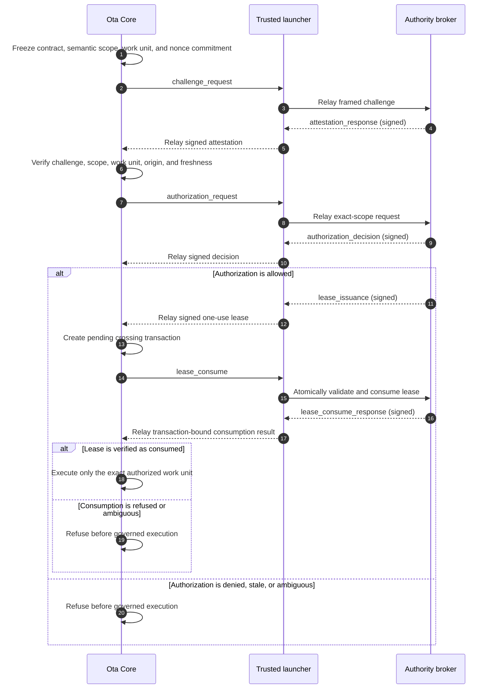

<!--
                █████
               ░░███
       ██████  ███████    ██████
      ███░░███░░░███░    ░░░░░███
     ░███ ░███  ░███      ███████
     ░███ ░███  ░███ ███ ███░░███
     ░░██████   ░░█████ ░░████████
      ░░░░░░     ░░░░░   ░░░░░░░░

   Copyright (C) 2026 — 2026, Ota. All Rights Reserved.

   DO NOT ALTER OR REMOVE COPYRIGHT NOTICES OR THIS FILE HEADER.

   Licensed under the Apache License, Version 2.0. See LICENSE for the full license text.
   You may not use this file except in compliance with the License.
   Unless required by applicable law or agreed to in writing, software distributed under the
   License is distributed on an "AS IS" BASIS, WITHOUT WARRANTIES OR CONDITIONS OF ANY KIND,
   either express or implied. See the License for the specific language governing permissions
   and limitations under the License.

   If you need additional information or have any questions, please email: os@ota.run
-->

# Ota Authority Protocol

Canonical, provider-neutral wire protocol for Ota crossing authority.

This crate publishes the stable message model, framing rules, semantic identity helpers, and
foundation vectors intended for Ota Core, trusted launchers, and independently operated authority
brokers. Cross-repository conformance becomes established only when those consumers pin and test
the same immutable crate revision.

## Boundary

This repository owns:

- protocol version and message-kind constants;
- exact serialized request, attestation, decision, lease, and consumption types;
- bounded four-byte big-endian framing;
- JCS plus SHA-256 message identities; and
- compatibility and adversarial conformance tests.

It does not own repository contracts, semantic-scope derivation, admission policy, signing keys,
approval workflows, broker persistence, transport credentials, execution, receipts, or archives.
Those remain with Ota Core, the authority launcher, and the chosen broker implementation.

## Wire sequence

The seven wire messages, in order, are `challenge_request`, `attestation_response`,
`authorization_request`, `authorization_decision`, `lease_issuance`, `lease_consume`, and
`lease_consume_response`. Ota may execute the governed work unit only after it verifies a signed
`lease_consume_response` bound to the pending crossing transaction.

Every JSON payload is carried in one frame: a four-byte unsigned big-endian payload length followed
by at most 64 KiB of UTF-8 JSON. Signed-message and identity domains are fixed protocol constants;
this crate canonicalizes bytes but does not select trust roots.

## Status

Preview foundation. Consumers should pin an immutable Git revision until a stable crate release is
published.

## License

Apache License 2.0. See [LICENSE](LICENSE).
